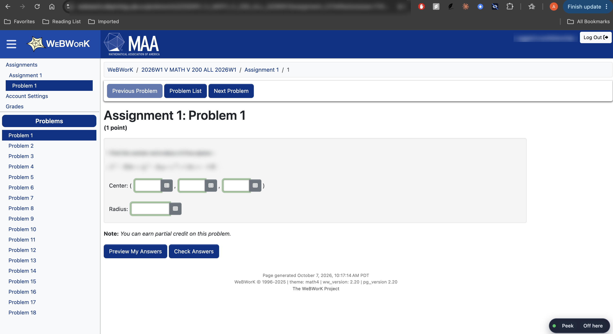
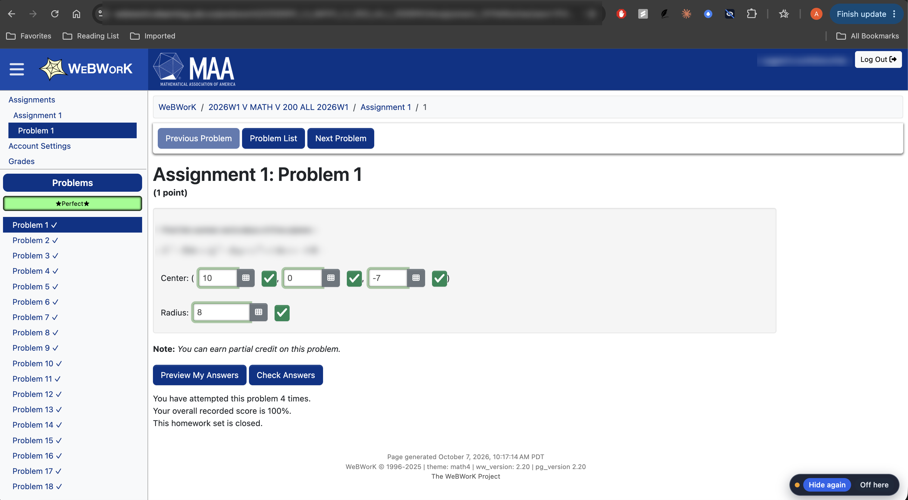
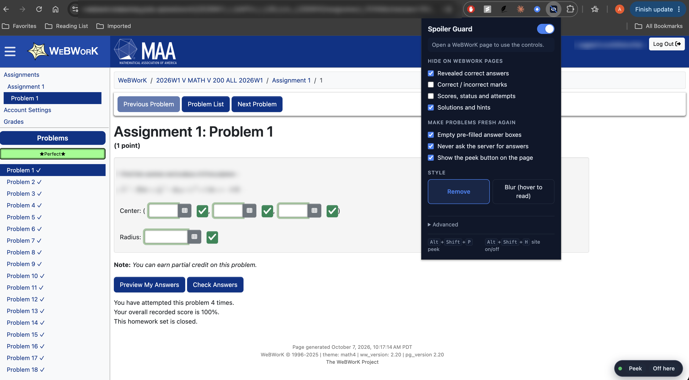

# WeBWorK Spoiler Guard

A Chrome extension that stops WeBWorK from spoiling its own problems once the due date has passed.

## Why

I wanted to redo old problem sets before an exam and couldn't. Once the answer date passes, WeBWorK re-fills every answer box with whatever I submitted the first time, turns the results table green, and prints "The correct answer is ..." right under the problem. There is nothing left to solve. The official "show me a blank copy" options either aren't enabled at my school or don't cover the feedback table.

So the extension blanks all of that out and gives you a Peek button for when you actually want to check yourself.

## Screenshots

An old, fully-graded set with the extension on. Blank boxes, no checkmarks in
the sidebar, no score line.



The same page after pressing Peek. Your old answers come back, along with
everything WeBWorK normally shows you.



The popup, with correctness marks and scores switched back on but revealed
answers still hidden. Each category is independent.



(The question text and the URL are blurred in these because it's my actual
course.)

## What it hides

- The revealed correct answer, and the Correct Answer / Answer Preview columns
- Correct and incorrect marks: the results table, green checks, red Xs, "your answer is correct"
- Scores: "Your overall recorded score is 100%", the Score / Status / Attempts columns, progress bars
- Solution and hint blocks

It also empties the answer boxes WeBWorK pre-fills from your last submission, and keeps `showCorrectAnswers` / `showSolutions` unchecked and stripped out of links so the server isn't asked for the answers at all.

Anything *you* type is never cleared. Only the value WeBWorK pre-filled.

## Install

Not on the Chrome Web Store yet. To run it from source:

1. Download this repo (Code -> Download ZIP, then unzip, or `git clone`)
2. Go to `chrome://extensions`
3. Turn on **Developer mode**, top right
4. **Load unpacked**, and pick the folder
5. Open a WeBWorK problem. A small pill shows up in the bottom-right corner.

Needs Chrome 105 or newer. Works in Edge, Brave, and other Chromium browsers too.

## Using it

**Peek** (the on-page pill, or `Alt+Shift+P`) shows everything again and puts your old answer back in the box. Press it again to re-hide.

**Off here** (or `Alt+Shift+H`) pauses the extension for that school's site.

The toolbar popup has per-category switches, a **Blur** mode where spoilers stay on the page blurred and un-blur when you hover them, and a switch for the on-page pill.

## If your school's WeBWorK isn't covered

It loads automatically on any URL containing `/webwork2/` or `/webwork/`, which is almost every install. If yours lives somewhere else, open a WeBWorK page, click the extension icon, and hit **Also run on this site**. Chrome asks for permission for that one domain and reloads the page.

## If something still leaks through

WeBWorK's HTML changes between versions, and schools install their own themes on top, so your site might have a spoiler mine doesn't know about. You can add it yourself:

1. Right-click the thing giving the answer away, then **Inspect**
2. Find a `class="..."` or `id="..."` on the highlighted element
3. Put it in the popup under **Advanced** as a CSS selector, `.that-class` or `#that-id`, one per line

That list runs on top of the built-in rules and syncs with your Chrome profile. If you find a selector that's worth shipping for everyone, open an issue with the school and the selector and I'll add it.

## Privacy

No network requests, no analytics, no accounts. Settings live in `chrome.storage.sync`, which is your own Chrome profile. See [PRIVACY.md](PRIVACY.md).

## How it works

`src/hide.css` is injected at `document_start`, before anything paints, and hides the known WeBWorK selectors. The important part is that everything is hidden *by default* and the script has to explicitly turn hiding off. If the script is slow or throws, the page fails toward not spoiling you, which is the direction you want to fail in.

`src/content.js` does what CSS can't:

- matches spoiler *phrases* in text nodes, so it survives markup changes between WeBWorK versions
- finds "Correct Answer" / "Score" columns by their header text and hides the whole column
- clears pre-filled inputs, including the MathQuill mirror spans, since clearing the hidden input alone doesn't change what you see
- re-runs on DOM changes through a `MutationObserver`, because WeBWorK redraws a lot

`src/background.js` routes the keyboard shortcuts and registers the content script on any extra domains you've granted.

## Layout

```
manifest.json       MV3 manifest
src/hide.css        selector rules, keyed on data-wwh-* attributes on <html>
src/content.js      text and column scanning, input clearing, on-page pill
src/background.js   shortcuts, per-site script registration
src/popup.*         toolbar settings UI
icons/              16/32/48/128 PNGs
```

No build step and no dependencies. Edit a file, hit reload on `chrome://extensions`.

## A note on what this is

This hides answers *from you* so old problems are worth redoing. It's a study aid. It doesn't touch what WeBWorK records: your scores and submission history on the server are exactly what they were, the extension only changes what your browser draws.

## License

MIT, see [LICENSE](LICENSE).
